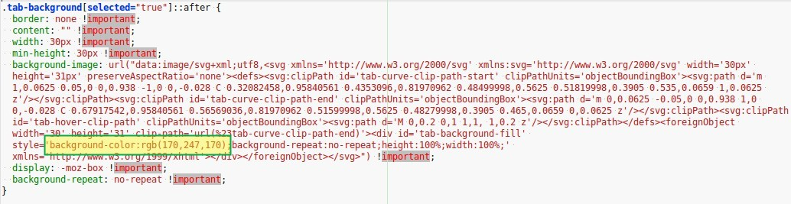

# Curvy Color tabs for Firefox Quantum

Turn Firefox Quantum's unattractive rectangular tabs...

... into curvy colorful tabs!

## Installation

Note: This has been tested only on Ubuntu 14.04 Trusty (with Unity), Xubuntu 14.04 Trusty (with XFCE) and Xubuntu 16.04 Xenial (with XFCE).

1. git clone this project somewhere.
2. Open `about:profiles` in FF.
3. Open the root directory of the profile in use shown on that page.
4. Create a subdirectory named `chrome/` under that profile directory.
5. Copy [userChrome.css](userChrome.css) from the cloned repo location into `chrome/` subdirectory.
6. Restart Firefox.

## Customize

Colors are part of the SVG (Scalable Vector Graphics) commands that draw the curvy tabs. You don't have to know CSS or SVG to customize them - you just need a text editor and a color chooser tool.

**Change the color of the active tab:**

1. First select the colors you want using a color chooser, and note down their decimal RGB values. 
   For example In the screenshot above, my preferred active tab color is a light green with the RGB code  `170,247,170`.
   ​

2. Open `PROFILE_DIRECTORY/chrome/userChrome.css` .
   ​

3. Some of the CSS styles contain  `background-color:` tags like this:

   

4. Modify the `background-color:` tag to the RGB value of your preferred active tab color in these styles:

   - `.tab-background[selected="true"]::before`
   - `.tab-background[selected="true"]::after`
   - `.tab-background[selected="true"] > spacer`

5. Save the file and restart Firefox

## Credits & License

The code here is copied from  Wilfred Wee's [photon-australis](https://github.com/wilfredwee/photon-australis), with minor modifications by me. I probably wouldn't have switched back to FF but for that project. I'd like to thank  him for all the great work in making FF Quantum look attractive. All copyrights belong to the original author and this project passes on the same license and permissions as the original project.

